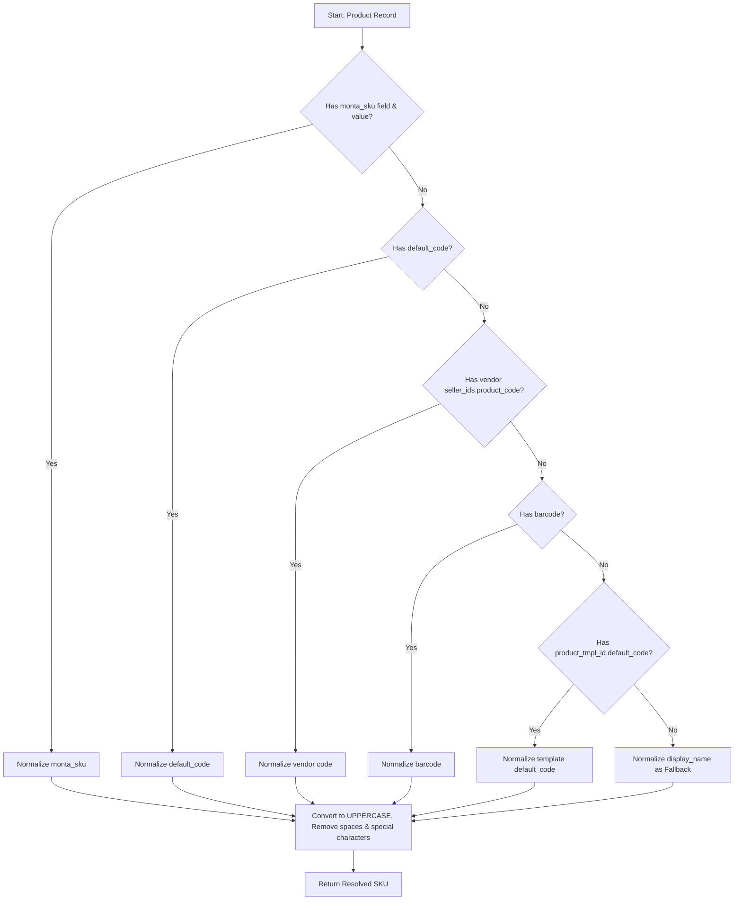

# Odoo-PostNL Integration Technical Documentation

Welcome to the comprehensive technical documentation for the **Odoo-PostNL Integration** module (`postnl_odoo_integration`). 

This module provides a seamless, automated, and secure bridge between Odoo and the **PostNL Fulfilment API**. It handles outbound sales order fulfillment, real-time shipment updates via webhooks, and inbound replenishment (inbound delivery) synchronization for Purchase Orders and Incoming Receipts.

---

## 🛠️ System Architecture & Workflow

The integration is built as a robust, non-intrusive Odoo module that extends standard sales, purchase, and inventory workflows. Below is a high-level architectural diagram showcasing the outbound order dispatch, inbound replenishment, and real-time webhook tracking processes.

```mermaid
graph TD
    %% Outbound Order Flow
    subgraph Outbound Order Flow
        SO[sale.order: action_confirm] --> Guard{URL Guard & Company Filter Allowed?}
        Guard -- Yes --> Explode{Bundle/Kit?}
        Explode -- Yes --> PackExpl[utils/pack.py: explode_product]
        Explode -- No --> ResolveSKU[utils/sku.py: resolve_sku]
        PackExpl --> ResolveSKU
        ResolveSKU --> AddressSplit[Split Address: Street/HN/Addition]
        AddressSplit --> WeightRule[Evaluate Weight-Based Shipping Rule]
        WeightRule --> Client[PostNLClient: send_sale_order]
        Client --> LogOut[postnl.order.log: HTTP POST Request]
        Client --> PostNL_API[PostNL Fulfilment Order API]
    end

    %% Webhook Inbound Flow
    subgraph Inbound Webhook Tracking
        PostNL_Event[PostNL Fulfilment Webhook] --> Receiver[controllers: receive_shipment]
        Receiver --> AuthGuard{Webhook Key Match?}
        AuthGuard -- Yes --> Queue[postnl.fulfilment.shipment.queue]
        Queue --> Cron[ir.cron: postnl_fulfilment_cron]
        Cron --> MatchSO[Find Matching sale.order]
        MatchSO --> UpdateSO[Update Tracking, Status, & Post Chatter Link]
        UpdateSO --> UpdatePicking[Update carrier_tracking_ref on picking]
    end

    %% Replenishment Flow
    subgraph Replenishment Flow
        PO[purchase.order: button_confirm] --> ReplPO[Create postnl.replenishment]
        picking[stock.picking: action_done] --> ReplPick[Create postnl.replenishment]
        ReplPO --> ReplService[postnl.replenishment.service: send_replenishment]
        ReplPick --> ReplService
        ReplService --> PostNL_Repl_API[PostNL Fulfilment Replenishment API]
    end
```



---

## 📂 Core Directory Structure

The module is structured adhering to standard Odoo 18 best practices, cleanly decoupling database models, business logic (services), utilities, routing (controllers), configurations, and user interfaces.

```bash
Odoo-PostNl-Integration/
│
├── __init__.py
├── __manifest__.py                 # Module manifests, pricing, dependencies
├── postnl_config.py               # Package-level configuration parameters
│
├── controllers/                   # Webhook endpoint routing
│   ├── __init__.py
│   └── postnl_fulfilment_receiver.py
│
├── data/                          # Webhook cron processor definition
│   └── ir_cron.xml
│
├── models/                        # Custom & extended database models
│   ├── __init__.py
│   ├── postnl_config.py           # Singleton Config model backed by ir.config_parameter
│   ├── postnl_shipping_rule.py    # Weight-based routing rules by country
│   ├── postnl_order_log.py        # Technical outbound log table
│   ├── postnl_fulfilment_queue.py # Webhook queue table for incoming statuses
│   ├── postnl_fulfilment_cron.py  # Background webhook queue processor
│   ├── postnl_replenishment.py    # Custom inbound replenishment log table
│   ├── sale_order.py              # Extended sale.order (action_confirm intercept)
│   ├── sale_order_postnl_fulfilment.py # Extended sale.order (webhook handler & tracking)
│   ├── purchase_order.py          # Extended purchase.order (replenishment hook)
│   ├── stock_picking.py           # Extended stock.picking (receipt replenishment hook)
│   └── res_config_settings.py     # Global Odoo settings extensions
│
├── security/                      # Database security records
│   └── ir.model.access.csv        # Access rights per user group
│
├── services/                      # REST API Clients & services
│   ├── __init__.py
│   ├── postnl_base.py             # Base service abstract wrapper
│   ├── postnl_client.py           # Core HTTP client for Outbound Orders
│   └── postnl_replenishment.py    # Core HTTP client for Inbound Replenishments
│
├── static/                        # Static assets (icons, banners)
│   └── description/
│       ├── icon.png
│       └── banner.png
│
├── utils/                         # Helper code & algorithmic utilities
│   ├── __init__.py
│   ├── pack.py                    # Phantom BoM & OCA Pack Line recursively exploding
│   └── sku.py                     # Monta-style flexible SKU resolver
│
└── views/                         # Views, List Views, Menus, Actions
    ├── postnl_config_views.xml
    ├── postnl_order_log_views.xml
    ├── postnl_replenishment_views.xml
    └── postnl_menu.xml
```

---

## 🗄️ Database Models Reference

This section outlines the custom Odoo models designed for configuration, tracking, queue management, and logging, as well as modifications made to standard Odoo entities.

### ⚙️ 1. Configuration & Rules

#### `postnl.config`
A singleton model representing global system configurations. The fields do not persist values inside a dedicated table row; instead, they transparently read/write system-wide parameters via Odoo's core `ir.config_parameter` table. This safeguards credential accessibility and ensures system-wide availability.
*   **Key Fields**:
    *   `api_url` (Char): Destination URL for the PostNL Outbound Order API.
    *   `postnl_inbound_url` (Char): Destination URL for the PostNL Inbound Replenishment API.
    *   `api_key` (Char, Password): PostNL API subscription key (rendered masked in UI).
    *   `customer_number` (Char): Customer ID provided by PostNL.
    *   `merchant_code` (Char): Merchant ID registered with PostNL.
    *   `fulfilment_location` (Char): Warehouse location code.
    *   `channel` (Char): Sales channel identifier.
    *   `default_product_code` (Char): Fallback shipping product code if no weight rules match.
    *   `allowed_base_urls` (Char): Comma-separated allowed base URLs (URL Guard).
    *   `allowed_company_ids` (Many2many): Restricts sync to specified companies.
    *   `rule_ids` (One2many): Child weight-routing rules.
*   **Source File**: [postnl_config.py](file:///Users/alihassan/Documents/Github/Odoo-PostNl-Integration/models/postnl_config.py)

#### `postnl.shipping.rule`
A weight-routing engine used to dynamically adjust the PostNL product code (e.g., standard parcel vs. letterbox) based on total package weight and destination country.
*   **Key Fields**:
    *   `product_code` (Char, Required): The PostNL product code mapping.
    *   `max_weight_kg` (Float, Required): Upper weight boundary (exclusive upper limit, sorted ascending).
    *   `country_ids` (Many2many): Set of target countries this rule applies to.
    *   `active` (Boolean): Allows pausing rules without deleting them.
*   **Source File**: [postnl_shipping_rule.py](file:///Users/alihassan/Documents/Github/Odoo-PostNl-Integration/models/postnl_shipping_rule.py)

---

### 📝 2. Logs & Queues

#### `postnl.order.log`
A detailed technical audit log recording all outbound sales order submissions to the PostNL API. Extremely helpful for debugging API payload discrepancies or communication failures.
*   **Key Fields**:
    *   `sale_order_id` (Many2one): The triggering Odoo Sales Order.
    *   `order_name` (Char): Cache of the Odoo Order reference.
    *   `destination_country_id` (Many2one): Target shipping country.
    *   `total_weight_kg` (Float): Total calculated shipment weight.
    *   `product_code` (Char): PostNL shipment method code assigned.
    *   `endpoint_url` (Char): Request destination URL.
    *   `http_status` (Integer): HTTP response status code (e.g., 200, 400).
    *   `success` (Boolean): Flags if the order was successfully accepted by PostNL.
    *   `error_message` (Char): Extracted error payload from the HTTP response.
    *   `request_payload` (Text): Full JSON request payload.
    *   `response_body` (Text): Raw JSON response body (up to 5000 characters).
*   **Source File**: [postnl_order_log.py](file:///Users/alihassan/Documents/Github/Odoo-PostNl-Integration/models/postnl_order_log.py)

#### `postnl.fulfilment.shipment.queue`
Persistent webhook queue to safeguard Odoo from losing tracking notifications in case of temporary database locks, service outages, or concurrent transaction retries.
*   **Key Fields**:
    *   `state` (Selection): Job lifecycle status (`new`, `processing`, `done`, `failed`).
    *   `attempts` (Integer): Counter of processing retries.
    *   `last_error` (Text): Captures stacktrace/error descriptions of processing failures.
    *   `payload` (Text, Required): Raw JSON webhook message received.
    *   `message_no` (Char): Webhook transactional message sequence.
    *   `merchant_code` (Char): Event context merchant code.
    *   `event_date` (Char) & `event_time` (Char): Timestamp variables sent by PostNL.
*   **Source File**: [postnl_fulfilment_queue.py](file:///Users/alihassan/Documents/Github/Odoo-PostNl-Integration/models/postnl_fulfilment_queue.py)

#### `postnl.replenishment`
Technical audit table capturing outbound replenishment (inbound shipments) synced to the PostNL Fulfilment API.
*   **Key Fields**:
    *   `name` (Char, Required): Document identifier (maps to Purchase Order name or Stock Picking name).
    *   `purchase_order_id` (Many2one): Originating purchase order (optional).
    *   `picking_id` (Many2one): Originating incoming receipt (optional).
    *   `merchant_code` (Char): Active merchant configuration code.
    *   `fulfilment_location` (Char): Warehouse location code.
    *   `state` (Selection): Inbound sync state (`draft`, `sent`, `error`).
    *   `request_payload` (Text): Full outbound JSON body payload.
    *   `response_message` (Text): API response text.
*   **Source File**: [postnl_replenishment.py](file:///Users/alihassan/Documents/Github/Odoo-PostNl-Integration/models/postnl_replenishment.py)

---

### 🔄 3. Standard Odoo Extensions

#### `sale.order`
*   **Action Intercept**: Overrides `action_confirm` to immediately trigger the `PostNLClient` outbound dispatch logic.
*   **Company Guard**: Safe filters check if the order's company is in `allowed_company_ids` (if configured).
*   **Status Fields**: Adds tracking columns (`postnl_fulfilment_order_no`, `postnl_track_trace_code`, `postnl_track_trace_url`, `postnl_fulfilment_status` (`pending`/`shipped`/`partial`/`error`), `postnl_last_webhook_at`, and `postnl_last_payload`).
*   **Dynamic Barcode Linker**: Computes `postnl_track_trace_url` using the pattern `https://www.postnl.nl/tracktrace/?B={barcode}&P={zipcode}` for instant shipping partner redirects.
*   **Chatter Notification**: Appends tracking codes directly inside the sales order's chatter log with clean HTML layout links.
*   **Source Files**: [sale_order.py](file:///Users/alihassan/Documents/Github/Odoo-PostNl-Integration/models/sale_order.py) & [sale_order_postnl_fulfilment.py](file:///Users/alihassan/Documents/Github/Odoo-PostNl-Integration/models/sale_order_postnl_fulfilment.py)

#### `purchase.order`
*   **Action Intercept**: Overrides `button_confirm` to automatically construct a `postnl.replenishment` record and dispatch it to the replenishment client.
*   **Source File**: [purchase_order.py](file:///Users/alihassan/Documents/Github/Odoo-PostNl-Integration/models/purchase_order.py)

#### `stock.picking`
*   **Action Intercept**: Overrides `action_done`. If an incoming receipt is validated (`picking_type_id.code == 'incoming'`), it automatically creates a `postnl.replenishment` log and sends the receipt quantity to the PostNL replenishment service.
*   **Chatter Propagation**: Webhook processing updates the picking's `carrier_tracking_ref` dynamically to keep inventory documents in sync.
*   **Source File**: [stock_picking.py](file:///Users/alihassan/Documents/Github/Odoo-PostNl-Integration/models/stock_picking.py)

---

## ⚙️ Core Architectural Workflows

### 🛡️ 1. URL Guard & Multi-Company Security Filters
To avoid sending fake test orders or replenishment notifications from a localized staging environment or developer computer, the module implements a robust double-lock guard mechanism inside both `postnl_client.py` and `postnl_replenishment.py` services:

1.  **URL Guard**: The configuration contains a field `allowed_base_urls` (e.g., `https://yourdb.odoo.com/, https://staging-yourdb.odoo.com/`). During execution, Odoo fetches the current database URL parameter `web.base.url`. If `allowed_base_urls` is defined, the integration blocks any HTTP POST requests if the current base URL does not match the whitelist, logging a descriptive warning instead.
2.  **Company Filter**: Multi-company configurations are verified by checking if the order's `company_id` is inside the `allowed_company_ids` list. If the list is defined and the order is from an unauthorized company, sync is skipped.

---

### 📦 2. Phantom BoM & OCA Pack Explosion
Fulfillment APIs require listing the actual physical products (leaf units) to be picked from the warehouse shelves. However, Odoo users sell bundles, kits, or product packs as single line items. 

To bridge this gap, `utils/pack.py` implements a recursive explosion algorithm:

```python
def explode_product(env, product, qty, visited=None):
    # 1) Phantom BoM explode (mrp.bom type phantom)
    bom = _get_phantom_bom(env, product)
    if bom:
        result = []
        bom_qty = float(bom.product_qty or 1.0)
        factor = (float(qty) / bom_qty)
        for bl in bom.bom_line_ids:
            result.extend(explode_product(env, bl.product_id, bl.product_qty * factor, visited))
        return result

    # 2) OCA product_pack explode (product.pack.line)
    if "product.pack.line" in env:
        pack_lines = _get_oca_pack_lines(env, product)
        if pack_lines:
            result = []
            for pl in pack_lines:
                result.extend(explode_product(env, pl.product_id, pl.quantity * qty, visited))
            return result

    # Leaf product
    return [(product, qty)]
```
*   **Algorithmic Safety**: Maintains a `visited` recursion set to halt execution and raise warnings in case of accidental recursive bundle references (e.g., Pack A contains Pack B, which references Pack A).
*   **Source File**: [pack.py](file:///Users/alihassan/Documents/Github/Odoo-PostNl-Integration/utils/pack.py)

---

### 🏷️ 3. Advanced SKU Resolution Engine
Standardizing SKUs is vital to avoid shipping discrepancies. The SKU resolver executes a prioritized list of fallbacks (inspired by robust warehouse integrations) to extract the correct shelf SKU:


*   **Source File**: [sku.py](file:///Users/alihassan/Documents/Github/Odoo-PostNl-Integration/utils/sku.py)

---

### 🗺️ 4. Dynamic Weight-Based Shipping Rule Evaluation
Before sending an order, the system computes the total physical weight of all shippable items (leaf products after pack explosion) by multiplying product weight (`leaf_product.weight`) with rounded-up quantity (`_ceil_qty(qty)`). 

It queries the `postnl.shipping.rule` table:
1.  Filters rules matching the order's destination country.
2.  Filters active rules where `max_weight_kg` is greater than or equal to the computed order weight.
3.  Orders the rules by `max_weight_kg asc` (ascending boundary check).
4.  Returns the first rule found. If no rules match, the default product code configured in the singleton parameters is assigned.

---

### 🏠 5. Address Splitting (Regex Parser)
PostNL Fulfilment requires separate fields for:
*   `street` (Street Name)
*   `houseNumber` (Numeric House Number)
*   `houseNumberAddition` (Additional details like building, flat, or room code)

Odoo represents address lines in open strings (`street`, `street2`). `PostNLClient` leverages a best-effort regular expression to parse these strings:
```python
def _split_street(street: str, street2: str = ""):
    full = " ".join([s for s in [street, street2] if s])
    full = re.sub(r"\s+", " ", full).strip()
    m = re.match(r"^(.*?)(?:\s+(\d+))(?:\s*([A-Za-z0-9\-\/]+))?$", full)
    if not m:
        return full[:30], 0, ""
    return (m.group(1) or "").strip()[:30], int(m.group(2) or 0), (m.group(3) or "")[:30]
```
This pattern perfectly matches Dutch and standard European address configurations (e.g. `"Keizersgracht 425 B"` splits into Street: `"Keizersgracht"`, HouseNumber: `425`, Addition: `"B"`).

---

### 📡 6. Webhook Receiver & Queue-Cron Architecture
To keep Odoo tracking states updated in near real-time, the module implements an asynchronous queue-cron webhook architecture. This ensures Odoo never rejects an incoming webhook if the database is under load.

#### Webhook Endpoint (`controllers/postnl_fulfilment_receiver.py`)
Exposes a public HTTP route `/postnl/fulfilment/shipment` supporting `POST` methods.
*   **Security Guard**: The endpoint intercepts request headers and validates an `apikey` parameter. It compares this value with `postnl_base.fulfilment_webhook_key` stored in `ir.config_parameter`. If unauthorized, it rejects with a `401 Unauthorized` response.
*   **Queue Ingestion**: Valid requests decode the JSON body and immediately store the raw request payload into `postnl.fulfilment.shipment.queue`, returning an instant `200 OK` to PostNL.

#### Cron Processing (`models/postnl_fulfilment_cron.py`)
A scheduled Odoo Cron Job (`ir_cron_postnl_process_shipment_queue`) executes the background processor `model.run_process_shipment_queue(limit=20)` periodically.
1.  Searches for pending queue records in status `new` or `failed`.
2.  Iterates and marks them as `processing`, incrementing attempts.
3.  Parses the stored JSON payload.
4.  Matches the order number (`orderNo`) against the database by searching across three fallback fields:
    ```python
    so = SaleOrder.search([
        "|", "|",
        ("postnl_fulfilment_order_no", "=", order_no),
        ("name", "=", order_no),
        ("client_order_ref", "=", order_no),
    ], limit=1)
    ```
5.  Triggers `_postnl_apply_shipment(meta, order_status)` to:
    *   Set the active PostNL order number.
    *   Parse the tracking barcode. In case of multiple/split shipments, it appends barcodes as comma-separated lists (`barcode1,barcode2`) and marks the state as `partial`.
    *   Map incoming dates and times to order tracking fields.
    *   Inject tracking links directly into the Sales Order chatter.
    *   Update the `carrier_tracking_ref` of associated open `stock.picking` documents.
6.  Updates queue record to `done` or marks it as `failed` with captured exception stacktraces.
*   **Cron Interval**: Defaults to **hourly**, adjustable in Settings.

---

## 📡 API Integration Payloads

### 1. Outbound Sales Order Payload (`POST {api_url}`)
Sent instantly on `action_confirm`. The request contains SKU resolution, rounded quantities, split addresses, and weight-based product routing codes.

```json
{
  "orderNumber": "SO00234",
  "webOrderNumber": "SO00234",
  "merchantCode": "MCH-883",
  "fulfilmentLocation": "AMS-WH01",
  "channel": "B2C-Odoo",
  "productCode": "3085",
  "orderDateTime": "2026-05-18T12:00:00",
  "orderLines": [
    {
      "SKU": "SHIRT-BLUE-M",
      "quantity": 2
    },
    {
      "SKU": "SHIRT-RED-L",
      "quantity": 1
    }
  ],
  "shipToAddress": {
    "firstName": "John",
    "lastName": "Doe",
    "street": "Keizersgracht",
    "houseNumber": 425,
    "houseNumberAddition": "B",
    "postalCode": "1016EK",
    "city": "Amsterdam",
    "countryCode": "NL",
    "phoneNumber": "+31612345678",
    "email": "johndoe@email.com"
  },
  "invoiceAddress": {
    "firstName": "John",
    "lastName": "Doe",
    "street": "Keizersgracht",
    "houseNumber": 425,
    "houseNumberAddition": "B",
    "postalCode": "1016EK",
    "city": "Amsterdam",
    "countryCode": "NL",
    "phoneNumber": "+31612345678",
    "email": "johndoe@email.com"
  }
}
```

### 2. Outbound Replenishment Inbound Payload (`POST {postnl_inbound_url}`)
Sent on Purchase Order confirmation or validated incoming picking.

```json
{
  "orderNumber": "PO00087",
  "merchantCode": "MCH-883",
  "fulfilmentLocation": "AMS-WH01",
  "orderDate": "2026-05-18",
  "plannedReceiptDate": "2026-05-20",
  "orderLines": [
    {
      "SKU": "SHIRT-BLUE-M",
      "quantity": 50,
      "description": "Blue Cotton Shirt - Medium"
    },
    {
      "SKU": "SHIRT-RED-L",
      "quantity": 100,
      "description": "Red Cotton Shirt - Large"
    }
  ]
}
```

### 3. Inbound Tracking Webhook Payload (`POST /postnl/fulfilment/shipment`)
Received from PostNL Fulfilment webhook events.

```json
{
  "merchantCode": "MCH-883",
  "type": "ShipmentNotification",
  "messageNo": "MSG-99081",
  "date": "2026-05-18",
  "time": "15:45:00",
  "orderStatus": [
    {
      "orderNo": "SO00234",
      "trackAndTraceCode": "3SDEAL99081234",
      "shipDate": "2026-05-18",
      "shipTime": "15:30:00"
    }
  ]
}
```

---

## 🔒 Security & Deployment Guards

1.  **Strict Error Separation**: In `stock_picking.py` and `purchase_order.py`, replenishment creation and API dispatch are wrapped inside isolated `try-except` blocks. If PostNL's API is temporarily unavailable or rejects a replenishment request, the integration logs a warning but **never blocks standard Odoo operations** (like receipt validation or order updates).
2.  **Credentials Hiding**: The `api_key` field in Odoo's custom configuration model is explicitly configured with `password="True"`, securing it in user views from unauthorized administrative extraction.
3.  **Webhook Authentication**: The webhook controller enforces standard HTTP API Key verification. All incoming webhooks must include an `apikey` header mapping to Odoo's configured `postnl_base.fulfilment_webhook_key` to avoid spoofing.
4.  **Transaction Safety**: By implementing the background shipment queue table, Odoo processes PostNL events out of lock contention risks, securing concurrent write performance.

---

## ⚙️ Operational Runbook & Configuration

### Odoo Configuration Setup
To initialize and configure the PostNL integration inside Odoo:
1.  Navigate to the **PostNL** root application menu (or go to General Settings under **PostNL** section).
2.  Fill in the **Authentication** configurations:
    *   **API URL**: Enter the production or sandbox order endpoint.
    *   **PostNL Inbound URL**: Enter the production or sandbox replenishment endpoint.
    *   **API Key**: Paste the security credential key provided by PostNL.
    *   **Customer Number**: Enter your customer ID.
3.  Set the **Defaults**:
    *   **Allowed Instance Base URLs**: Whitelist active domain URLs (e.g. `https://production.yourdomain.com`).
    *   **Merchant Code**: Configured merchant identifier.
    *   **Fulfilment Location**: Configured fulfillment warehouse location.
    *   **Channel**: Desired tracking channel name.
    *   **Default Product Code**: Standard shipping code fallback.
    *   **Allowed Companies**: (Optional) Whitelist specific companies in a multi-company database.
4.  Define **Weight Rules** inside the notebook page:
    *   Select standard product codes (e.g., standard parcel, letterbox, heavy parcel).
    *   Provide maximum weights in kilograms.
    *   Link destination countries to map specific shipping profiles automatically.

---

## 📈 System Monitoring & Troubleshooting

### Investigating Failed Orders
1.  Navigate to **PostNL > Orders** (or the technical menu).
2.  Review the lists of entries in the **PostNL Order Logs**.
3.  Failed attempts are flagged with `Success = False` and highlight the returned `HTTP Status` and `Error` messages.
4.  Open the log record to inspect the exact `Request Payload` sent and the raw `Response Body` received to identify validation failures (e.g., invalid zip codes, missing product SKUs, etc.).

### Troubleshooting Webhooks
1.  If tracking numbers are not appearing on confirmed Sales Orders, check the webhook queue under **PostNL > Webhook Queue** (if exposed) or query the `postnl.fulfilment.shipment.queue` table directly.
2.  Verify the background cron job **PostNL: Process Shipment Queue** (`ir_cron_postnl_process_shipment_queue`) is set to `Active = True` under **Settings > Technical > Scheduled Actions**.
3.  Check Odoo server logs for any warning messages prefixed with `[PostNL Guard] BLOCKED` or `[PostNL Repl Guard] BLOCKED` which identify URL mismatch blocks.
